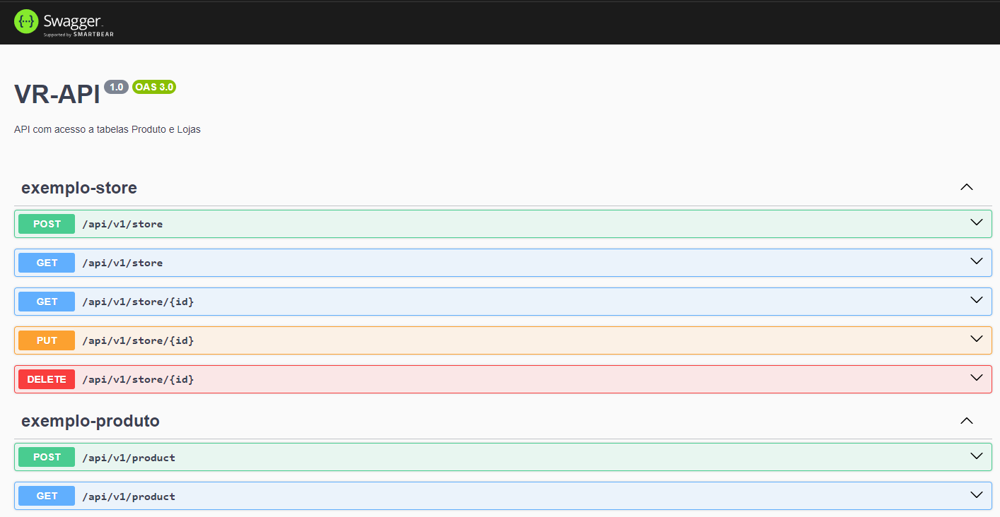
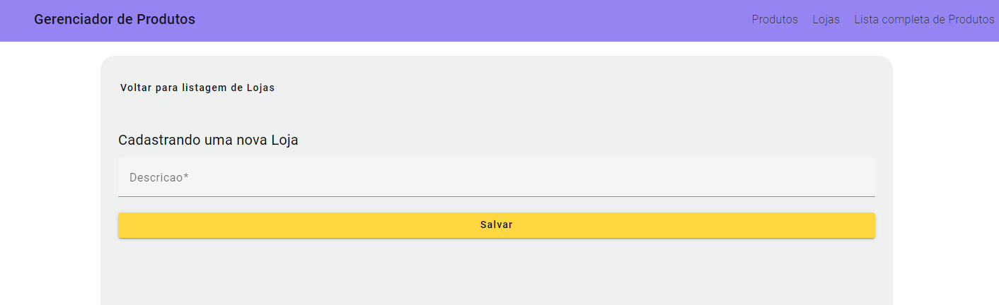
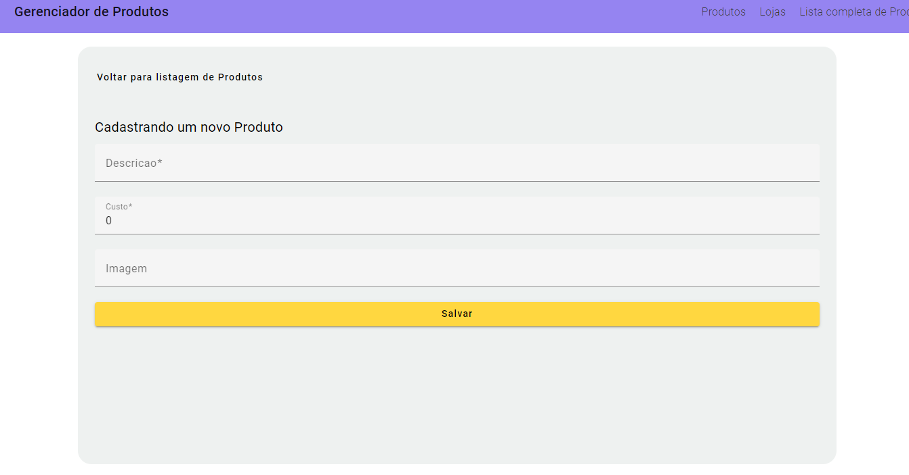
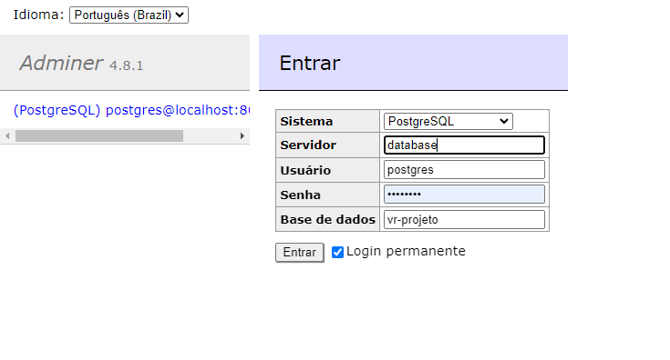
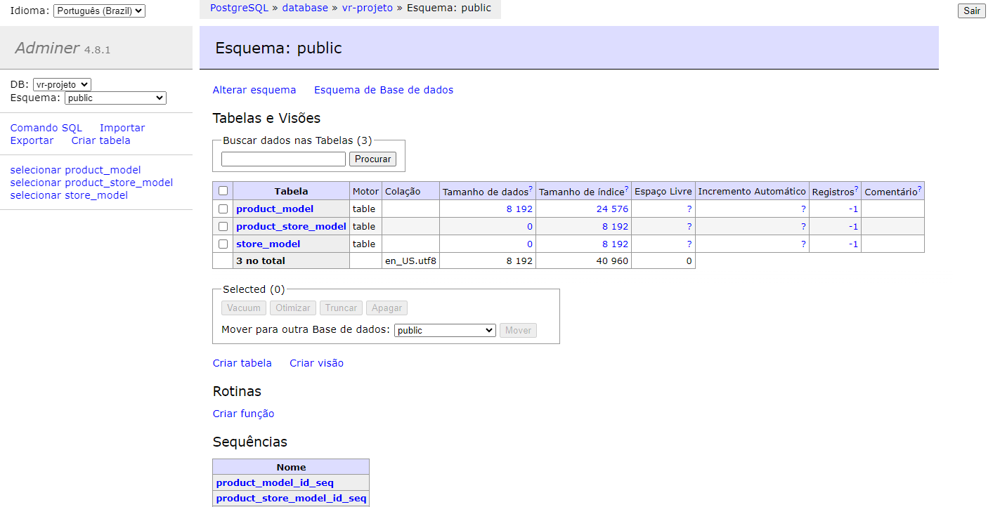

# _aplication-vr_
### Inserindo aplicação completa Backend, Frontend e Postgres

### Clonar o projeto
#### Dentro da pasta vr-aplicacao/vr-api
- Instalar pacotes e dependências descritas no package.json
  - Comando: `npm install`
- Criar imagem do PostgreSQL conforme o docker-compose.yml
  - Comando: `docker-compose up`
- Criar um arquivo .env
  - Inserir a mesma string de conexão que está no .env.example
- Iniciar a API
  - Comando: `npm run start:dev`
  - A aplicação ficará disponível na rota http://localhost:8080
  - E disponibilizando o Swagger na porta http://localhost:8080/api

  

#### Dentro da pasta vr-aplicacao/vr-front
- Instalar pacotes e dependências descritas no package.json
  - Comando: `npm install`
- Iniciar o frontend
  - Comando: `npm run start`
  - A aplicação ficará disponível na rota http://localhost:4200

    
    

#### Após o banco ser instanciado e gerado no Docker,
- Acessar o Adminer na rota http://localhost:8085
  - Realizar o login através das informações:
    - Sistema: PostgreSQL
    - Servidor: database
    - Usuário: postgres
    - Senha: postgres
    - Banco de Dados: vr-projeto

  
  
